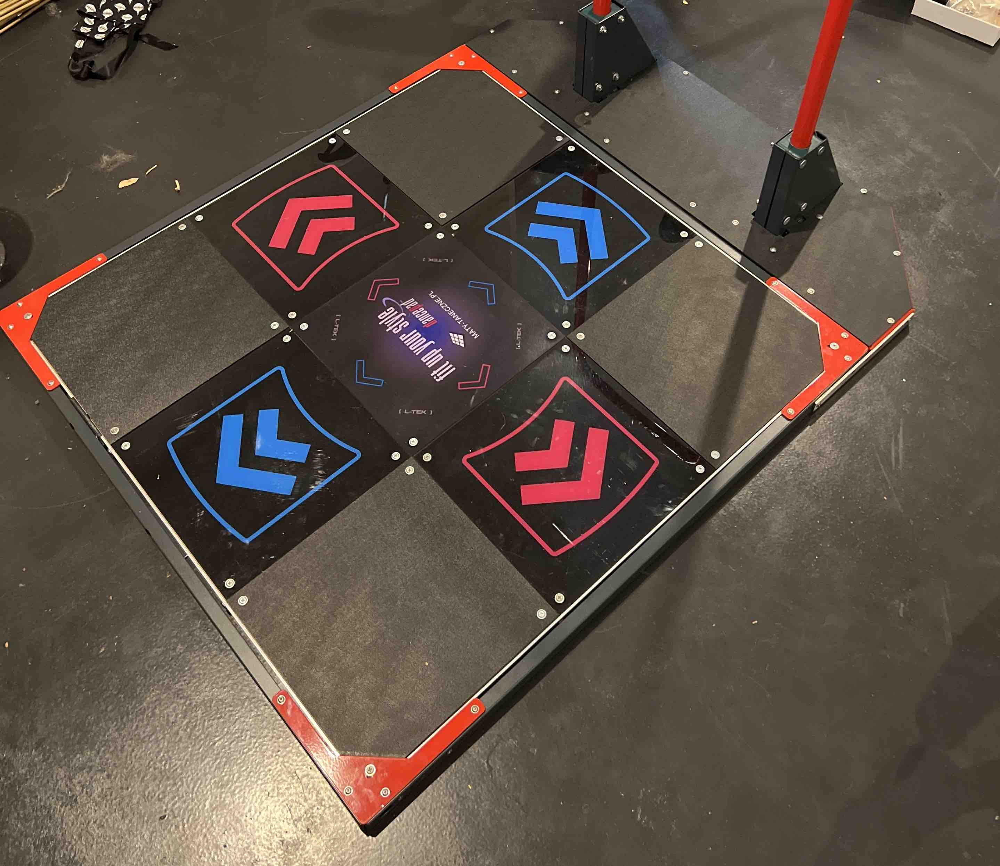
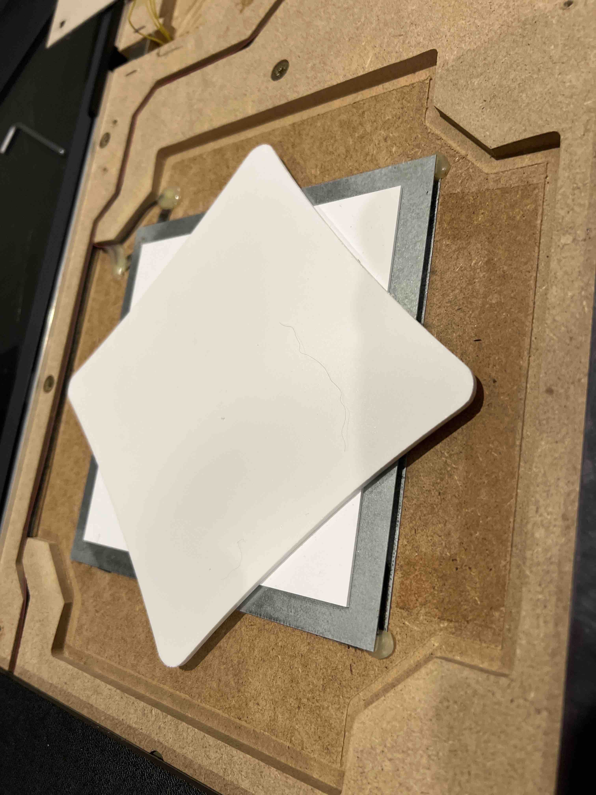

### A brief introduction
Hello and welcome to the start of my blogging adventures. This is all quite new to me, so I'll be working it out as I go along. Although this post is meant to serve as some pre-reading for my blogs to come outlining my FSR project, I will also take it as an opportunity to introduce myself.

If you've found your way here, chances are you know me as either Chris or Bauxe. I'm a developer with a pretty keen interest in arcade stuffs. I've been programming as a hobby for around 10 years now, and professionally for 3.

### Starting the FSR project
I've been playing DanceDance Revolution (henceforth referred to as DDR) on and off since I was probably around 7. That's not to say I'm necessarily any good, but I certainly enjoy playing when I can. Despite this, I have never had an at-home solution, instead needing to travel to out-of-the way locations to get my fix, as my rhythm game budget had traditionally gone towards controllers for other such games, that have less availability in Australia (or more specifically, Melbourne).

Some time during towards the end of 2020, I heard of [RE:Flex Dance](https://reflex.dance/), a high-quality build-it-yourself dance pad. Although I didn't take too much notice at the time, some time around mid 2021 I decided I should build one. Unfortunately, due to the ongoing semi-conductor shortage and rising cost of aluminium, I was looking at around $1,200 per pad _minimum_ (this was probably closer to around $400 at the end of 2020).

After shelving the idea for a number of months, I had the opportunity to grab an [L-Tek](https://www.maty-taneczne.pl/) for a pretty awesome price (taking into consideration the insane feight cost when sourced from L-Tek) early 2022. Of course, these aren't the greatest pad money can buy, but how bad can it be?

After some initial testing... Pretty bad honestly. Not to say they are useless, they are extremely affordable when compared to more premium pads such as the [SMX](https://www.stepmaniax.com/), but no doubt I can do better. The internal circuitry is quite basic, a small board with contacts in each panel.

Thanks to the lovely [DDRPad](https://ddrpad.com/) site, the common flaws are already solved. They cover basic mods, such as ['Penny Modding'](https://ddrpad.com/products/l-tek-pad-sensitivity-penny-mod) and polling rate improvements, through to more sophisticated mods such as installing [Force-sensing resistors](https://en.wikipedia.org/wiki/Force-sensing_resistor)

### The next steps
While this all seems good enough for my needs, and it certainly is, it would be pretty boring to just use what others have built. I'd like to use this as a chance to deepen my understanding on some topics, not necessarily to a high, or even moderate level, basic is enough.

So for some quick self-estimation going into this, I would say I am...
- Proficient with front-end development (absolutely useless with design though :))
- Minor knowledge of microcontroller programming. Mostly just some Arduino stuff, never anything too crazy
- Zero understanding about electronics
- Lackluster handy-man skills (specifically woodworking, metalworking, etc)

In the next post, I will be discussing the initial steps to improve the dance pad.