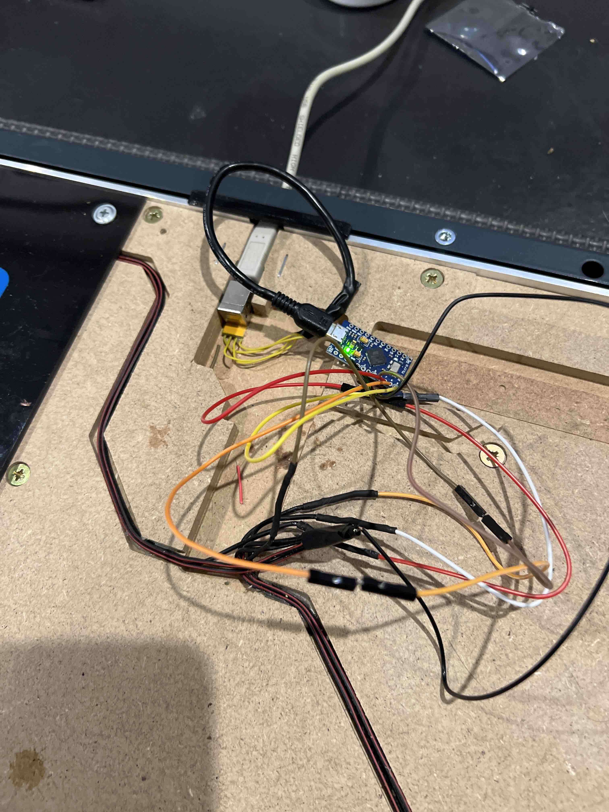
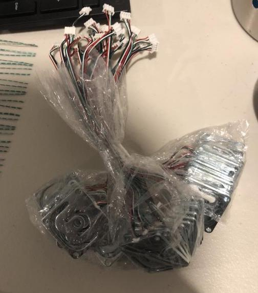
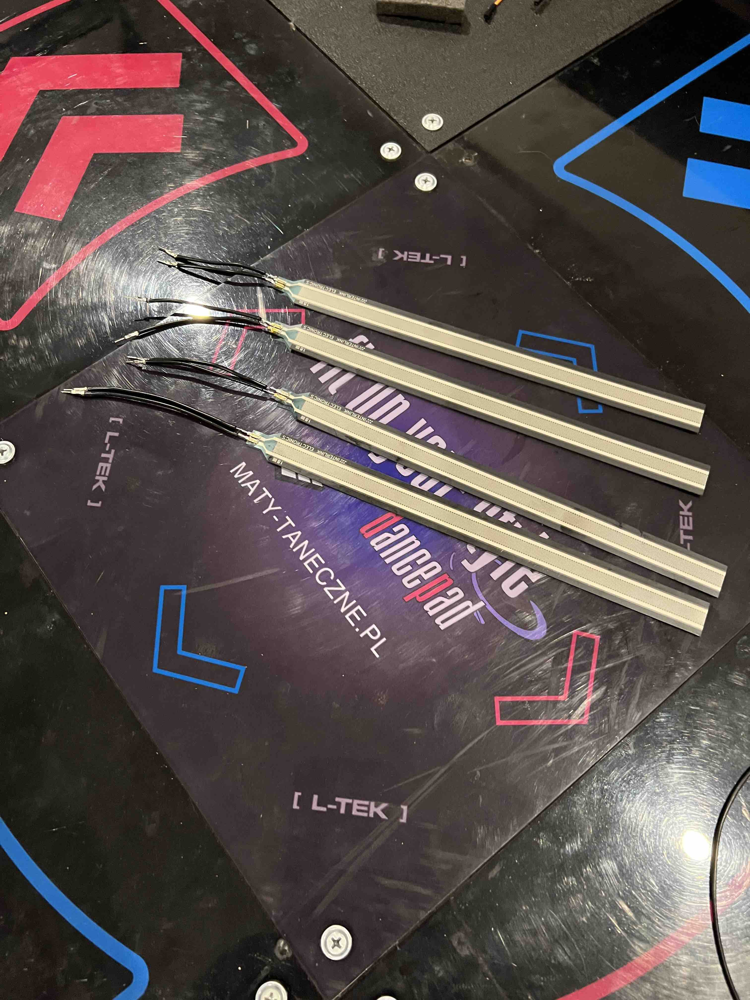
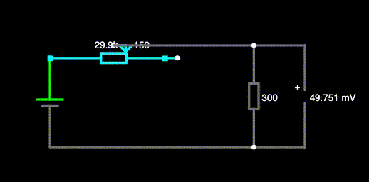
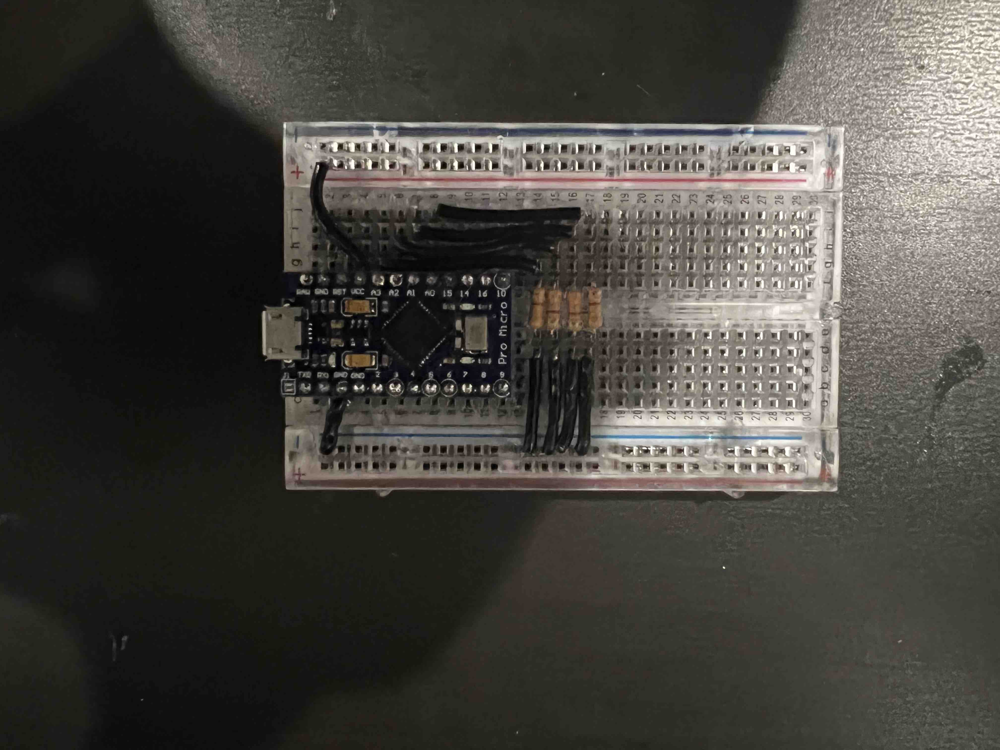
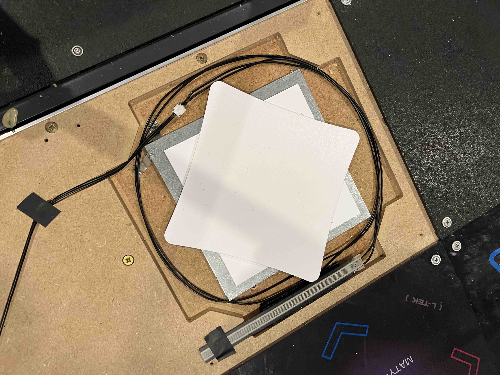

### The penny mod
This is the first mod I had experienced. Admittedly, I had no real intention of using it, but the previous owner had already done this. The purpose is pretty self-explanatory. Each panel is essentially a switch. You step on the panel, a sheet of metal pushes down into a second sheet of metal, connection complete. By taping a few coins around the edges of each sheet of metal (5 cent coins, I'm not American :)), the travel distance is shorter. This supposedly improves consistency, and is almost always the first mod done to these pads.

Probably a good time to note the reason the pad was sold pretty cheap. One of the panels didn't function too well. There were regular mis-fires leading to a pretty bad experience. I never really experienced this, but I'm guessing that's because I never really used it in the form I received it.

### 1000hz mod
These days, the L-Tek pad comes with a circuit board providing a 1000hz signal. Unfortunately, until quite recently, they came with a board that polled at only 125hz! When dealing with <20ms timing windows, an 8ms drift can cause substantial difficulty. While they do sell the [new board](https://www.maty-taneczne.pl/shop/usb-controller-board-diy/), I wasn't about to spend around $50 and wait weeks for it to arrive.

Thankfully, this is a solved problem. Armed with nothing but an Arduino and some shitty soldering skills, it was pretty easy to install a replacement board to poll at 1000hz thanks to [this guide by StarlightLumi](https://www.instructables.com/Modifying-an-L-tek-Dance-Pad-to-Poll-at-1000hz-on-/)!

This felt _much better_. Of course, far from perfect, but it was a start!

### Sourcing my Force-sensing Resistors (FSRs)
After playing around 10 seconds of DDR, I decided I needed to do more. I had read about using FSRs to give a more precise button stomping experience, and figured I would give it a go. For those curious, an FSR simply outputs varying resistance based on the amount of force applied. This allows for analog-based input instead of the binary input from the standard panels.

Back when I first started looking at the RE:Flex Dance pad, I started buying some components in preparation. One of these purchases was a stack of load cells. These operate in a similar fashion to an FSR, but, from my understanding, with better precision. Unfortunately using these in a circuit requires op-amps, and all other kinds of black magic circuitry well beyond my knowledge. Therefore, this idea too was quickly shelved.

FSRs are pretty affordable. The ones I went for (FSR-408) are sold for $3 USD from the [supplier](https://buyinterlinkelectronics.com/collections/new-standard-force-sensors/products/fsr-model-408), $6 USD on [DDR Pad](https://ddrpad.com/products/force-sensitive-resistor-fsr-sensor-long-200mm-size?_pos=3&_sid=827cbdcfe&_ss=r) and $33 on [DigiKey](https://www.digikey.com.au/en/products/detail/interlink-electronics/34-00071/7672216) what the fuck?

Seems pretty simple, just grab them from the supplier and be on my way. Unfortunately, they have a flat-rate international shipping fee of **$99 USD**. They can bring this down to $63 USD if you contact their sales team, but $63 shipping for $12 product doesn't seem worthwhile.

It's the same story from DDR pad, a flat-rate fee of **$99** for international purchases (however this was recently lowered slightly to around $86). As a result, all options end up being just about the same cost. I'd guess the best option would be find a friend or proxy service in America and get it shipped over cheap, but I instead opted to just buy from DDRPad with a bunch of other parts (which will be used sometime in the future).

So a few weeks and a few hundred dollars later, I had my FSRs.

### FSR Installation
FSRs are pretty straight forward to hook up. As my understanding goes, as the resistance across the variable resistor decreases, the voltage across the output (??) increases. Here is a demonstration.

I opted to start using a breadboard at this point to better organise the wires, as it was becoming pretty messy. This was the final wiring before adding in the FSRs.

I uploaded [Teejusb's FSR sketch](https://github.com/teejusb/fsr) onto the Arduino, wired it up, and it was good to go.

Getting these to work well was quite a bit more challenging than I was expecting. Having them near the centre of the panel resulted in too little pressure being applied, while sitting on the outside resulted in a huge amount of pressure coming from the plastic panel cover. I eventually opted for using some rubber underneath the FSRs, as well as some washers between the wooden base and plastic covers to reduce the pressure.

### Closing words
This was a pretty good start. The pad felt fantastic, and was more than playable. Of course, this would be pretty boring if I stopped here. I was experiencing occasional issues probably relating to debouncing, and wanted to clear up some of the internals. In the next post, I will be talking about how I approached these problems. :)