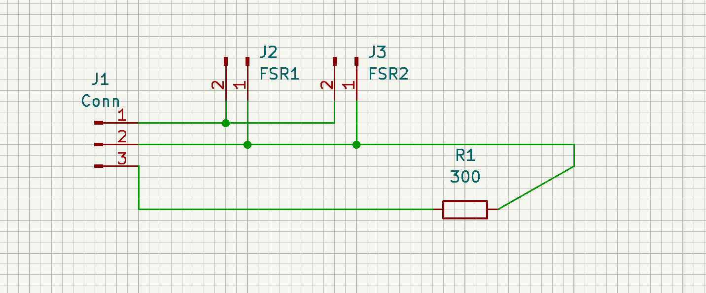
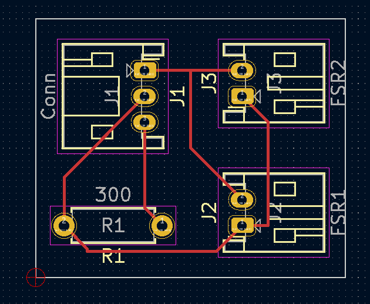
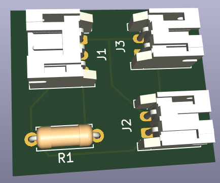
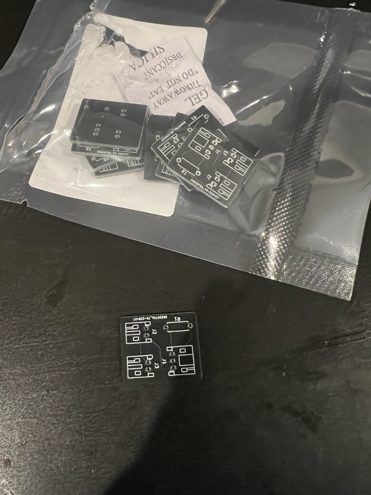
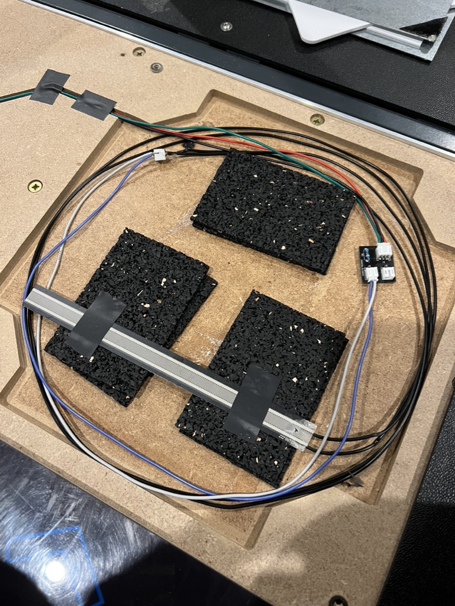
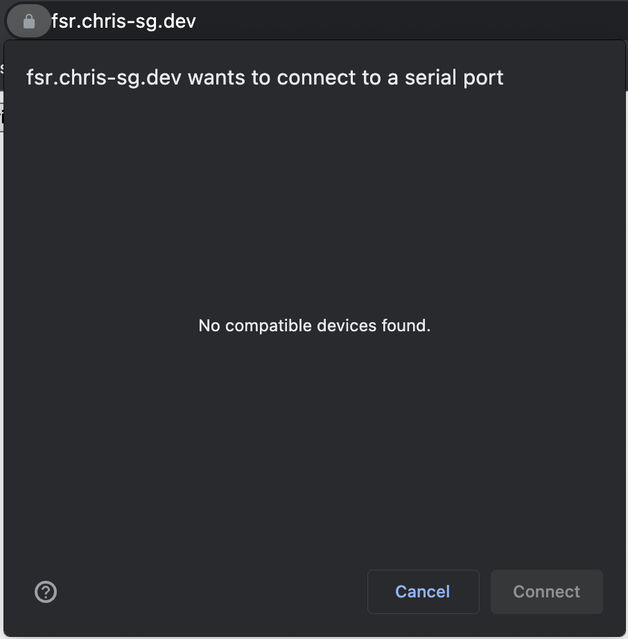
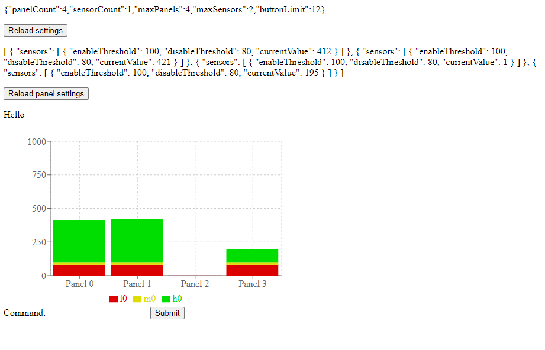

### Arduino improvements
I suppose before I get too far into this, I should probably mention that this is (from memory) the first time creating anything for an arduino. A lot of the basic understanding of the pad functionality came from [Teejusb's FSR sketch](https://github.com/teejusb/fsr), and I decided to adjust it to suit my needs. I can't say for sure if it is better, but [here is my go at creating an arduino sketch for a dancepad](https://github.com/Chris-SG/ddr-fsr-pad). This following section is going to be geared more towards readers with an understanding of software development, so it may be worth skipping if you aren't too interested in that. :)

This was a surprisingly challenging undertaking for me. I haven't worked with C++ for a number of years, and C for even more. On top of that, debugging issues when dealing with both software _and_ hardware is much more difficult than I expected!

To start, I broke down the general project down into a few core components that I identified. These were:
- fsr -> This is the main entrypoint of the program. It is probably a bit big, but that's okay
- panel -> This is a datastructure and associated functionality to support a single panel
- sensor -> This is a datastructure and associated functionality to support a single sensor. Note a panel can have multiple sensors
- serial_processor -> This is general serial processing. It reads in serial input, and calls an associated matched function

Surprisingly, these have remained suitable throughout the whole process, I haven't yet changed them.

#### First Iteration

I first wrote a _very_ basic joystick implementation based on the aformentioned sketch by Teejusb. This included an actuation point, and a number of basic commands based around reading the panel settings and setting pressure levels. This did have some added complexity, due to the sensors previously mentioned.

> I had my partner test the pad initially when using Teejubs's sketch. She doesn't play DDR or any other such games, and as such her feet tend to gravitate more towards the centre of each panel. The sensors were placed at the inner edge of each panel, and as such would often not have sufficient pressure applied to fire. My rudimentary solution to this was to simply add more sensors (1 on each edge).

And thus the sensor idea came to fruition. It wasn't really that different, instead just enabling the panel if _any_ of the sensors met their corresponding threshold (yes, each sensor can have its own threshold). But of course, this didn't solve the deboucing issues.

A reasonable person at this point would do some research into common debouncing algorithms or implementation patterns. Instead, I took an idea and went with it. A pretty simple one at that.
1. A sensor has a `pressThreshold` in which the sensor will report itself as pressed.
2. A sensor has a `depressThreshold` in which the sensor will report itself as depressed.
3. A sensor has a `stepRate` which controls how rapidly the pressure can increase.

To give a more concrete example, lets take a press threshold of 300, a depress threshold of 200, a stepping rate of 20 and a polling rate of 10 (for simplicity, in reality the polling rate is, of course, 1000hz). When the panel has pressure applied to it, the current reported pressure will increase at a rate of 20 each poll. This equates to a maximum increase of 200 a second. If the force applied is 375, it will take 1.8 seconds to reach this number, however a press will be registered after 1.5 seconds. Next, if the pressure is relieved, it will start to drop at the same rate of 20. Once it reduces under 200, the sensor will now report as unpressed. This means 0.9 seconds later, this will happen.

By separating the press and depress values, putting an exact amount of pressure, say 300, will not continually trigger the button due to slight pressure changes (ie. moving between 299 and 301). In reality, the pressure numbers above would happen in ~20ms and can be reduced further, so it seems to be a sensible solution. There is typically at least 200ms between arrows, so it seems unlikely that it will cause some kind of delay / drift.

One last little improvement I snuck in was saving settings to EEPROM. Teejusb's sketch resets if you power off the Arduino, which is pretty painful. By writing the pad settings to EEPROM whenever a change occurs, we are able to restore this on startup!

You can find the code for this first iteration [here](https://github.com/Chris-SG/ddr-fsr-pad/commit/10702747169435f8adf4d60137a78137fbe508b8#diff-8d2fc7ac78c173dfc3b13b0e4cc43f360dda226cf13ef6effa608cd8e2b5a961).

#### Second Iteration

This is where I ran into my first major obstacle. I am not used to dealing with small amounts of RAM, and the Arduino of choice (Arduino Pro Micro) has a tiny 2.5kb (yeah, I know this is probably a _lot_ for some embedded devices). I started adding various 1kb buffers for logging, adding debug code that was always present, etc, just general bad ideas. This didn't cause any issues at first, until I wanted to build in some more customisation. I was looking to give the option to _change_ the panel and sensor counts at runtime. This involved using a bunch of dynamic allocation, temporary variables, and other junk. While I don't really have any kind of proof, I suspect this lead to to plenty of crashes. The board would often stop responding after running any commands to change these settings.

After struggling with this for a while, I decided to go back to using static arrays instead. There are definitions for the maximum number of panels, and maximum number of sensors. This will create an array with a number of panels to support the panel number, and each panel will have an array that can handle the sensor number. Some further refactoring of debug logic, and we were back in business.

The code for this iteration can be found [here](https://github.com/Chris-SG/ddr-fsr-pad/commit/49a829afb0edeccbcea101e56f979afcf52a7fb2#diff-8d2fc7ac78c173dfc3b13b0e4cc43f360dda226cf13ef6effa608cd8e2b5a961).

#### Final Iteration

I did a pretty substantial rewrite here, primarily around the serial processing. Previously, `serial_processor` was handling all of the actions, such as setting management and responding with data. A more sensible approach was to register actions (callbacks) and just trigger them.

```c++
class SerialProcessor {
    ...
    void SetPrintPanelDataAction(void (*print_panel_data)(uint8_t index)) {
        this->print_panel_data = print_panel_data;
    }
    ...
    void (*print_panel_data)(uint8_t index);
    ...
}

void SerialProcessor::Process() {
    ...
    switch(buf[0]) {
        case 'p':
            uint8_t panelIndex;
            if (sscanf(buf, "p %hhu", &panelIndex)) {
                print_panel_data(panelIndex);
            }
            break;
        ...
    ...
}
```

I added some resilience changes, better debug information, and small cleanup, but for the most part, everything seemed okay at this point. The finished code is [here](https://github.com/Chris-SG/ddr-fsr-pad).


### My first board
Circuit boards are pretty cool, but I have no knowledge of electronics. While I can definitely learn circuit design over time, I figured I would give it a crack. At this point in time, I was sick while on a holiday in Vietnam, so I figured it was as good a time as any.

My idea was pretty simple, it doesn't actually do anything. I just wanted something to replace the disgusting wiring inside each panel, so that's what I started on. I opted to use KiCad6, and pretty much _everything_ I learnt was from [this video by shabaz](https://www.youtube.com/watch?v=5Be7XOMmPQE).

I started with designing the schematic. I wanted to try adding multiple sensors to a single analog pin, since the Arduino I am using only has 9 available analog pins, allowing for 2 per panel. This is achievable by hooking up the sensors in parallel, however it does adjust the resistor required (I think, electronics idiot so not too sure). This is what I came up with (basic ik):



Knowing absolutely nothing about what connectors are generally used, I opted to use JST-XH connectors. These are small, pretty easy to source and cheap. A few hours on KiCad and YouTube later, I had a PCB layout completed!




I sent this off to JLCPCB, and shortly after returning home, I had my freshly made PCBs all ready to go. :)



I took this as an opportunity to remove the original panel switches to clear up some more space for upcoming work, and instead use some rubber as support. Here is what it looks like inside the panel



I quickly noticed some obvious improvements, but that is going to come in another post. For now, I am pretty happy with how they turned out. They work as expected, and thats as much as I can ask for on my first attempt!


### A web-ui for panel configuration
Up to this point, I had been configuring my pad settings through the Arduino serial monitor. This is, obviously, far too tedious for any kind of usable product. Teejusb, again, already had something like this ([see here](https://github.com/teejusb/fsr)), however it involved running a python backend, with a react frontend, which requires a bit more technical-know-how than preferable. I identified the [Web Serial API](https://developer.mozilla.org/en-US/docs/Web/API/Web_Serial_API) which seemed to be a perfect option. My general plan was:

- Have a web UI that can be hosted anywhere (ie. static app)
- Allow the user to configure the pad
- Provide a visual representation of the pad data

I opted for a React app, using Yarn as the package manager and Parcel as the bundler. After what felt like too many hours of setup (I could bitch for hours about the complexity of setting up a JS project), I had a skeleton ready to go.

The WebSerial API is quite interesting. At the moment, it is only available in Chromium-based browsers (Chrome, Edge, Opera). This is because Apple and Mozilla view it as a harmful [1](https://mozilla.github.io/standards-positions/#webserial). Although it is pretty scarcely used (its actually pretty hard to find anything that uses it past a few example projects), it is super easy to work with ([Serial API spec](https://developer.mozilla.org/en-US/docs/Web/API/Web_Serial_API)).

The implementation I settled on was pretty straight forward. We first have a class that holds all of the state, as well as performs some setup.

```ts
class PadSerialManager2 {
    private encoder = new TextEncoder();
    private decoder = new TextDecoder();

    private port?: SerialPort;
    private open: boolean = false;

    private writes: Array<string> = [];
    private callbacks: Array<SerialEventCallback> = [];

    constructor() {

    }

    public init = async (): Promise<boolean> => {
        if (!browserHasSerial()) return false;

        const filters = [
            { usbVendorId: 0x2341, usbDeviceId: 0x8037 }
        ];
        try {
            this.port = await navigator.serial.requestPort({ filters });
        } catch {
            return false;
        }
        return true;
    }

    public connect = async () => {
        if (!this.port) return;
        try {
            await this.port.open({ baudRate: 115200, bufferSize: 255, dataBits: 8, flowControl: 'none', parity: 'none', stopBits: 1 })
            this.open = true;
            this.monitor();
            this.processWrite();
        } catch {

        }
    }

    public close = async () => {
        await this.port?.readable?.cancel();
        await this.port?.close();
    }
}
```

In this case, running `init()` will do an in-browser prompt for the user to connect to a serail device. We are able to filter this to only include our chosen devices, in this case Arduino Pro Micros.



Upon initialising our serial connection, we are able to use the `connect()` method to connect to our device. You may notice the call to `monitor()` and `processWrite()`, these will be mentioned later.

As this is using a data-in data-out approach (ie. when a user issues a command, it may need the response in order to perform some action), it is important read and writes are synchroized. The first step to this is ensuring there is a clear separator between responses. In my case, any response from the serial device will terminate with `\u0004\u0003`. We are then able to pass the corresponding data to a callback for further processing.

For the write processor, we first have a method to add a write request to the queue. The writer has a lock, and thus can only be used synchronously, which is why we do not want to try to instantly write a message.

```ts
    public write = async (data: string, callback?: SerialEventCallback) => {
        callback && this.callbacks.push(callback);
        this.writes.push(data);
    }
```

We have made the callback optional in this case, as not every command will have a callback. For instance, the `c` command (clear) simply wipes the devices EEPROM and does not respond.

We now have a processor that is _always_ running to process these messages as they come in.

```ts
    private processWrite = async () => {
        while (this.open) {
            const nextMessage = this.writes.shift();
            if (nextMessage && this.port?.writable) {
                const writer = this.port.writable.getWriter();
                await writer.write(this.encoder.encode(nextMessage));
                writer.releaseLock();
            } else {
                await new Promise(resolve => setTimeout(resolve, 2));
            }
        }
    };
```

This doesn't have too much safety in it. There could certainly be issues if the port ends up locked or unwritable, but we are going to just ignore that for now :). This polls every 2ms to check for a message. When a message is found, the writer will write the next message in the list to the serial device.

Next up is the reader. This bit gave me a massive headache, and I'm still not really sure where the issue was. We have named our reading method `monitor`, as shown below.

```ts
    private monitor = async () => {
        const dataEndFlag = new Uint8Array([4, 3]);
        while (this.open && this.port?.readable) {
            this.open = true;
            const reader = this.port.readable.getReader();
            try {
                let data: Uint8Array = new Uint8Array([]);
                while (this.open) {
                    const { value, done } = await reader.read();
                    if (done) {
                        this.open = false;
                        break;
                    }
                    if (value) {
                        data = Uint8Array.of(...data, ...value);
                    }
                    if (data.slice(-2).every((val, idx) => val === dataEndFlag[idx])) {
                        const decoded = this.decoder.decode(data);
                        const callback = this.callbacks.shift();
                        callback && callback(decoded);
                        data = new Uint8Array([]);
                    }
                }
                console.log("stopped monitoring");
            } catch {
                console.log("fatal?");
            }
        }
    }
```

This is a bit more involved, and could do with some simplification, but for now, it works.

We start by ensuring the port is readable. Like the write portion, there can only be a single reader present. As such, we quickly claim the reader after checking if it is available.

`{ value done }` is quite misleading, at least to me (it probably seems more intuitive to people who have worked closely with readers and writers). Done doesn't indicate it is done reading a block of text, it instead indicates the reader itself has been cancelled or closed.

Whenever `value` is populated with some data, we add it to our data block. This is to ensure we can read data across multiple reads in case of fragmentation. This will repeat until we come across our data termination flag, mentioned previously. Once we have a match, we:
- Decode the data into a string
- Check if there is a callback and if so, call it
- Reset our data block

Now as mentioned, there was a problem I came across. I observed that, after writing a command, the `await reader.read()` would block for exactly 1000ms, every time. This is a massive concern, as if we want to be reading live data, we need to be able to rapidly request and process data. Having a chart that can only update every 1 second seems pretty useless. Worse yet, after testing the various Serial API examples, there was only _1_ that did not have this problem: [webserial by williamkapke](https://github.com/williamkapke/webserial).

The solution, after 2 days of banging my head against a wall, was unfortunately very simple. I simply had to append a newline `\n` to the end of each write. I had studied william's implementation plenty of times to see what he was doing differently, but nothing really came up. I went as far as to copy his exact code, and still had the problem. Turns out, his app was appending a newline character before sending it to the serial processor.

With all that out of the way, I was able to complete a basic implementation of my vision. It isn't pretty, and it is still missing a lot, but its a start. And it works.



You can find the code [here](https://github.com/Chris-SG/fsr-cfg) and a live version of the site at [https://fsr.chris-sg.dev/](https://fsr.chris-sg.dev).


### Closing

This has been a pretty long writeup. I have since started work on some more circuit board stuff (still basic) and I am looking into some more major modifications. I have played some DDR on the pad, and I can say with certainty that is it working fantasticly! Super excited for what is still to come.